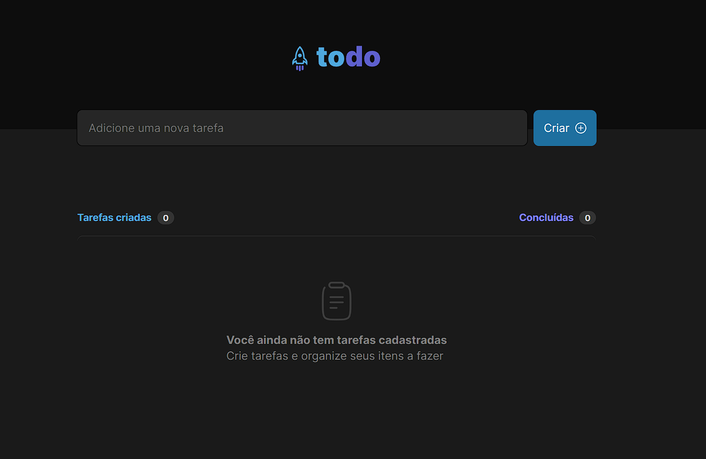

# to-do app

Solução desenvolvida do desafio 01 da trilha de ReactJS da Rocketseat [Ignite - ReactJS](https://app.rocketseat.com.br/).

## Table of contents

- [Overview](#overview)
  - [The challenge](#the-challenge)
  - [Screenshot](#screenshot)
- [My process](#my-process)
- [Built with](#built-with)
- [What I learned](#what-i-learned)

## Overview

### The challenge

Aplicação ToDo produzida como desafio do Ignite com funcionalidades como: criar tarefa, marcar como concluída e remover da lista.

### Screenshot

### Links

- Solution URL: [ToDo App](https://lm-todo.vercel.app/)

## My process

### Built with

- ReactJS
- Typescript
- SCSS
- Lib uuidv4
- Figma

### What I learned

- React Props
- React Hooks
- JavaScript functions
- Semantic HTML5
- Flexbox
- Figma
- DOM
